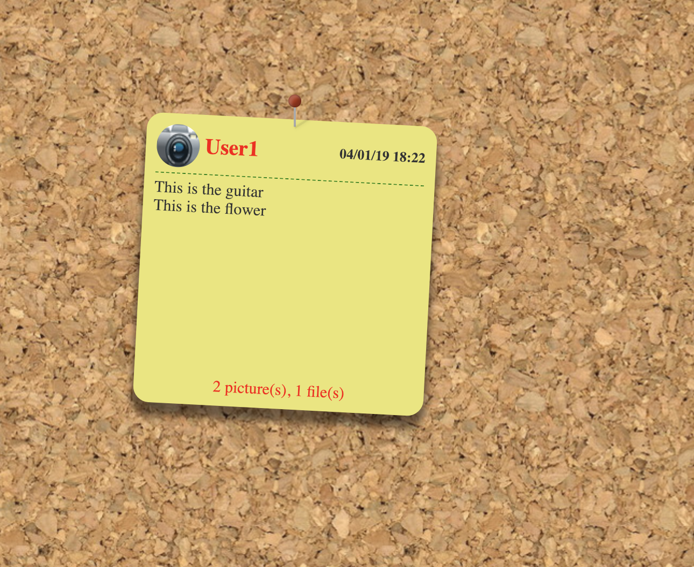

# Pinboard

Pinboard is a web based application where registered users can login and add or delete notes on a shared pinboard. In the notes, users can put simple texts, pictures or files. Editing and changing the place of a note in a pinboard is allowed. All changes are reflected to all logged users in real time.

In this document the way to run the application and the code structure will be explained.

## Requirements and Instructions to Run

In this section, the requirements and instructions on how to run the application will be given.

The application has the following dependencies:

* Java 8 or newer
* MongoDB

MongoDB must be running while the server is running.

//TODO: Add a compiled JAR file to the repository and explain how to run it

After running the server, the application can be accessed by URL **"http://localhost:7000/pinboard"**. It will redirect to the login page if the user is not logged in before.

## Usage

This is the initial screen when entering to **"http://localhost:7000/pinboard"**

It is just an empty page because there is no pinboard added before. To add a new pinboard, you can click to the **+** icon at the right-top of the page. Then, the page will appear as the following:

This way, a pinboard is created with title "NEW BOARD" and at the bottom of the title the icons of users which have the right to access to this pinboard are shown. Currently, only the user who created this pinboard has the right to access to it so only one icon is visible.

When hovering to the box, three icons will appear on the top (shown in the image above). They can be used to change the title, grant/remove access rights for users and delete the pinboard. The following is the appearance of the board after its title is changed and an access right is granted to another user (note that after this step, the board will appear on the main page of both users).

To go to the pinboard to see/add notes, double-click to the box. It will lead to the following page:

Currently, this page is empty as no user has added any postits. A new postit can be added by double-clicking to a place on the pinboard. Then the following popup will appear:

Here the size of a textbox can be changed and it can be deleted or moved. To do so, just click to the text and the border of the textbox will appear:

Then, it can be resized, deleted or moved. It is also possible to add a new text box. To do so, just double-click to an empty point, a new text box will appear.

It is also possible to add a picture in the note. It can be done by just dragging a picture file into the white part of the popup. Then picture can be resized, moved or deleted just in the same way with text boxes.

Finally, a file can be added to the note. To upload a file drag the file into the gray rectangle at the bottom of the popup. Currently, a file cannot be bigger than 20MB but this limit can be changed by updating application.properties file. This will be the appearance after uploading a file:

To remove the file, just hover into the box with the filename and press X button (the same way for removing textboxes and pictures). To add the note into the pinboard, click "Save". Then in the pinboard, a new postit should appear.

Now, any user which has the right to access this pinboard can see this postit. Note that in the postit, pictures are not appearing and only texts are visible. However, a user can double-click to the postit and see all the contents. After double-clicking the postit, a user can edit and see the postit if (s)he is the creator of it, otherwise it is read-only. Also, the files uploaded for this postit can be downloaded.

A postit can be deleted by its creator. To delete, just drag the pin of the postit to an empty space of the pinboard. After the left mouse button is released the postit will start falling down and disappear from the pinboard. In the picture below, you can see a postit to be deleted, its pin is dragged outside so it is to be removed from the pinnboard.

It is also possible to move a postit inside a pinboard and arrange the pinboard this way. Note that creation/removal/move of postits are reflected in real-time to all users who have the pinboard opened inn their web browser. 

  